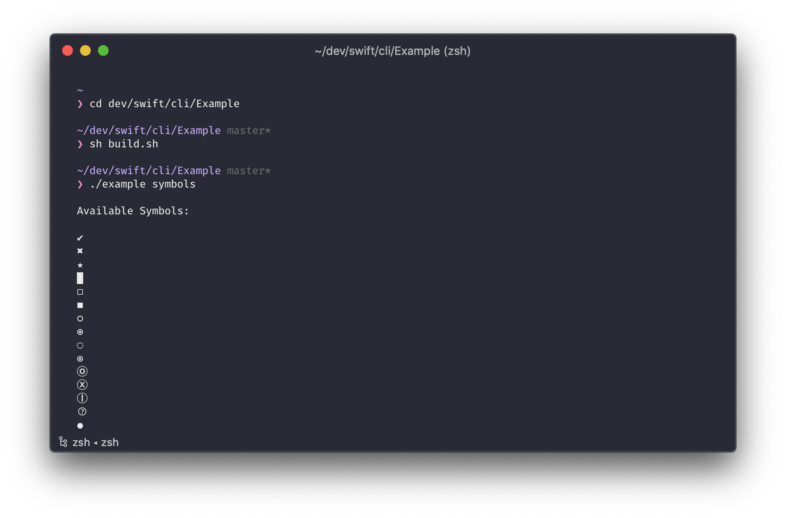

# cli

<!-- badges: start -->

<!-- badges: end -->

A hobby project to learn swift.

## Example

Run an example

1. Open Terminal and go to the `Example` folder.
2. Run `sh build.sh` script to build sample application.
3. Run `./example symbols` to view all available symbols.

