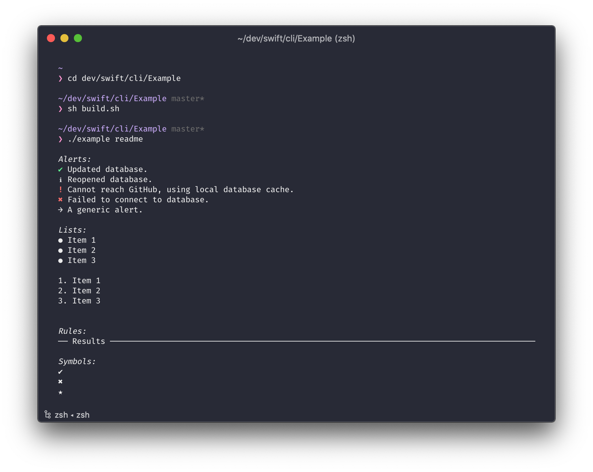

<!-- badges: start -->
<p align="center">
  <a href="https://travis-ci.org/tylurp/cli"></a>
  <a href="https://codecov.io/gh/tyluRp/cli"></a>
  <a href="https://github.com/tyluRp/cli/blob/master/LICENSE"></a>
</p>
<!-- badges: end -->

#

A hobby project I'm working on to learn swift. Takes the source code from 
[ColorizeSwift](https://github.com/mtynior/ColorizeSwift) and the API design from 
[cli](https://github.com/r-lib/cli). The goal is to (eventually) provide semantic elements like 
alerts, lists, rules, unicode characters, headings and more to build beautiful CLIs easily. 
Currently contains:

1. Unicode symbols: `Symbols.tick`, `Symbols.bullet`, etc.
2. Alerts: `AlertSuccess()`, `AlertWarning()`, etc.
3. Lists: `OrderedList()` and  `UnorderedList()`
4. Everything from ColorizeSwift, I've copied the source code to be used in this project so we 
have access to all it's awesome features (colored text, styles and more)

```swift
// Alerts
print(AlertSuccess("Updated database."))
print(AlertInfo("Reopened database."))
print(AlertWarning("Cannot reach GitHub, using local database cache."))
print(AlertFailure("Failed to connect to database."))
print(AlertGeneric("A generic alert."))

// Lists
print(UnorderedList("Item 1", "Item 2", "Item 3"))
print(OrderedList("Item 1", "Item 2", "Item 3"))

// Symbols
print(Symbols.tick)
print(Symbols.cross)
print(Symbols.star)
```

## Example

There are a couple examples you can demo:

1. Open Terminal and go to the `Example` folder.
2. Run `sh build.sh` to build the example application.
3. Run `./example readme` to view the output of the README example.


