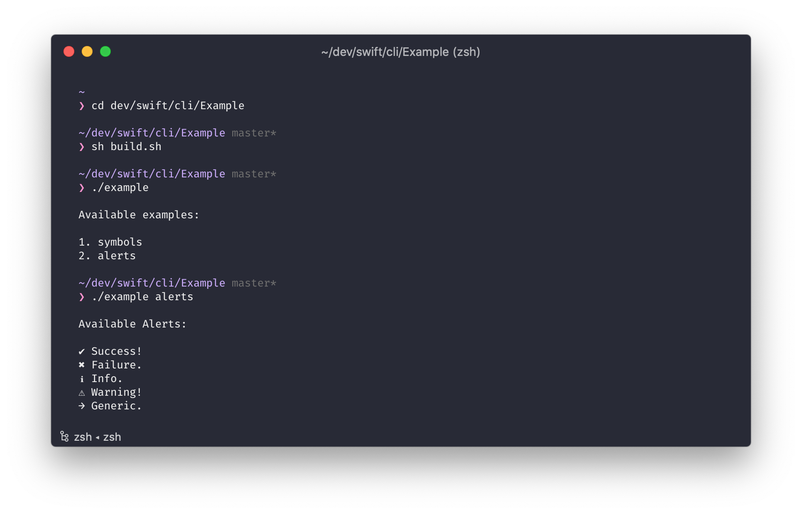

# cli

<!-- badges: start -->

<!-- badges: end -->

A hobby project I'm working on to learn swift. The idea is to create a package similar to the 
#rstats package [cli](https://github.com/r-lib/cli).

## Example

Run an example

1. Open Terminal and go to the `Example` folder.
2. Run `sh build.sh` script to build sample application.
3. Run `./example alerts` to view all available alerts.

